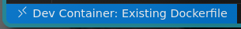
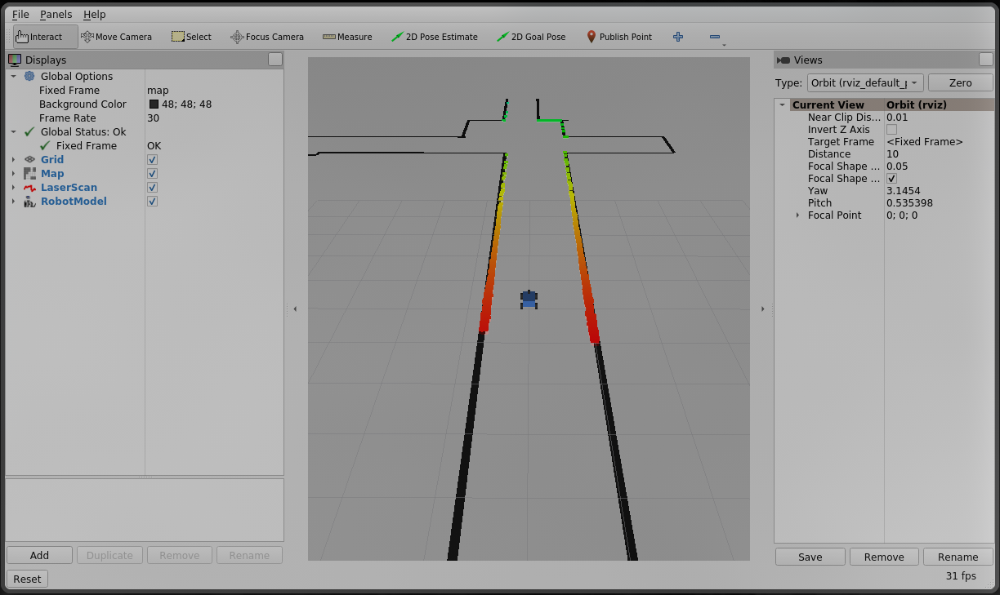

# Installation
1) install [docker](https://docs.docker.com/get-docker/), on windows you don't have to do this now
2) clone this repo
```bash
git clone https://github.com/JoshCu/f1tenth_gym_ros.git
```
3) open it in vscode
4) if you don't have devcontainers installed a popup will prompt you to install the extension
5) if you don't have docker, it will ask if you want to install wsl, you do, then reboot
6) click "reopen in container" in the popup on the bottom right
7) wait

# Test changes
To test any changes, either rebuild and reopen the container which wipes everything outside of this repo   
Or the faster option, rebuild the ros package
```bash
cd /sim_ws/
colcon build
# if you add any new files
source /opt/ros/foxy/setup.bash
```

# Testing the simulator
Once you have the container open you'll see this and any terminals you open in vscode will be inside the container.   
   
open a terminal and run   
```bash
cd /f1tenth_gym/examples/
python3 waypoint_follow.py
```
if waypoint_follow.py doesn't work, but the code below does work 
```bash
apt-get install x11-aps
xclock
```
don't worry about it, just run it via ros using the commands below

# Running the simulator through ros
This will run the simulator without rendering pyglet flat display and instead uses rviz to visualise the ros topics.
```bash
ros2 launch f1tenth_gym_ros gym_bridge_launch.py
```   
you should see something like this   
   

## Control the car
You can control the car using ros commands published to /cmd_vel.
To test it manually, run the keyboard controller.
```bash
# In a new terminal in vscode
ros2 run teleop_twist_keyboard teleop_twist_keyboard
```

# Ros topics
```bash
# to list every topic
ros2 topic list
# to print a topic to screen (extremely noisy)
ros2 topic echo /scan
# /scan is the lidar
```

## change map
Modify the path to the map in config/sim.yaml
